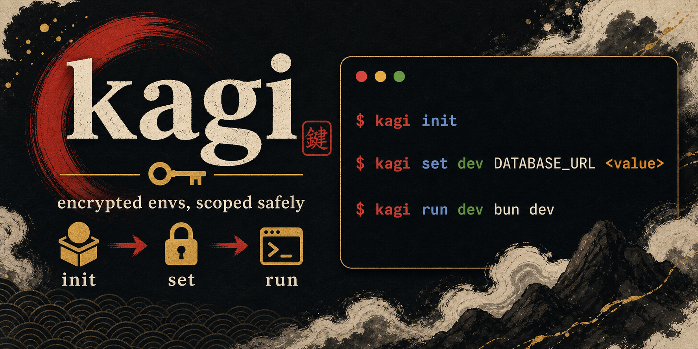

# kagi



A CLI tool for managing encrypted environment variables with per-service isolation.

**kagi** (鍵, Japanese for "key") keeps your secrets encrypted at rest using XChaCha20-Poly1305 while making them easy to inject into applications during development and deployment.

---

## Features

- Encrypted secrets at rest with XChaCha20-Poly1305.
- Team-ready by default: one developer is just one member.
- Service and environment scopes like `api/development` and `web/production`.
- `development` is the default environment, so daily commands stay short.
- Nested service inference lets `kagi run bun dev` work inside `./api`.
- `.kagi/` is designed to be committed; private keys stay on each device.
- `get --show` and `export` require terminal confirmation before revealing values.

---

## Installation

### From Git

```bash
# Default: includes the remote sync server
cargo install --git https://github.com/BANG88/kagi.git

# CLI-only: excludes server code and server-related commands
cargo install --git https://github.com/BANG88/kagi.git --no-default-features
```

Requires Rust 1.85+ (2024 edition).

### From a local checkout

```bash
git clone https://github.com/BANG88/kagi.git
cd kagi

# Default: includes the remote sync server
cargo install --path .

# CLI-only: excludes server code and server-related commands
cargo install --path . --no-default-features
```

---

## Daily Development

### 1. Initialize once

```bash
kagi init --nested --envs
```

`--envs` without a value creates the standard environments:
`development`, `test`, and `production`.

`development` is the default, so you usually do not type it. `--nested` lets
kagi infer the service from the folder you are in.

Commit the generated `.kagi/` files:

```bash
git add .kagi .gitignore
git commit -m "chore: initialize kagi"
```

Private keys are not written to `.kagi/`.

### 2. Set secrets

From the repository root:

```bash
kagi set api DATABASE_URL postgres://localhost/api
kagi set api production DATABASE_URL postgres://db/prod
```

Inside `./api`:

```bash
kagi set DATABASE_URL postgres://localhost/api
kagi set production DATABASE_URL postgres://db/prod
```

Both short commands write to the same scopes:

| Command | Scope |
|---------|-------|
| `kagi set api DATABASE_URL ...` | `api/development` |
| `kagi set DATABASE_URL ...` inside `./api` | `api/development` |
| `kagi set api production DATABASE_URL ...` | `api/production` |
| `kagi set production DATABASE_URL ...` inside `./api` | `api/production` |

### 3. Check what exists

```bash
kagi get
kagi get api
kagi get api production
```

`get` lists services, environments, and keys with masked values. Reveal values
only when you really need them:

```bash
kagi get api --show
kagi get api DATABASE_URL
```

Both commands require an interactive `y` confirmation.

### 4. Run your app

From the repository root:

```bash
kagi run api bun dev
kagi run api production bun start
```

Inside `./api`:

```bash
kagi run bun dev
kagi run production bun start
```

`kagi run` injects the selected environment variables into the child process.
For shell syntax such as pipes, redirects, or `$VAR` expansion, run a shell
explicitly:

```bash
kagi run api sh -c 'echo "$DATABASE_URL" | wc -c'
```

### 5. Commit encrypted changes

```bash
git add .kagi
git commit -m "chore: update kagi secrets"
```

Do not commit real `.env` files. `kagi init` updates `.gitignore` so `.env`,
`.env.*`, and local private material stay out of Git.

---

## Common Commands

| Task | Command |
|------|---------|
| Initialize with standard envs | `kagi init --nested --envs` |
| Set development secret | `kagi set api KEY value` |
| Set production secret | `kagi set api production KEY value` |
| List masked keys | `kagi get` |
| Reveal listed values | `kagi get api --show` |
| Run app with development env | `kagi run api bun dev` |
| Run app from inside service folder | `kagi run bun dev` |
| Add an environment | `kagi env add staging` |
| Rename an environment | `kagi env rename staging preview` |
| Delete an environment | `kagi env del preview` |
| Import an env file | `kagi import api --file .env.local` |
| Export all service envs | `kagi export api --out .` |
| Sync missing keys from example | `kagi sync --service api` |

Use `--service <name>` when a shortcut would be ambiguous:

```bash
kagi set --service api production DATABASE_URL postgres://db/prod
kagi run --service api production bun start
```

Environment names cannot conflict with existing service names.

---

## Working With `.env` Files

Import existing local files:

```bash
kagi import api --file .env.development
kagi import api production --file .env.production
```

Export creates normal runtime files when needed:

```bash
kagi export api --out .
```

That writes one file per environment:

```text
.env.development
.env.test
.env.production
```

Exporting decrypted values requires terminal confirmation. Prefer `kagi run`
for day-to-day scripts.

`sync` is useful when `.env.example` gains a new key:

```bash
kagi sync --service api
```

Existing values are never overwritten.

---

## Team Flow

A project is always team-ready. If you work alone, you are the only member.

New device or teammate:

```bash
kagi member join --name alice
git add .kagi/access.json
git commit -m "chore: request kagi access"
```

An existing member approves:

```bash
kagi member list
kagi member approve <member_id>
git add .kagi/access.json
git commit -m "chore: approve kagi member"
```

If multiple people request access at the same time, keep all pending entries in
`.kagi/access.json` when merging their PRs.

Remove access:

```bash
kagi member del <member_id>
git add .kagi
git commit -m "chore: remove kagi member"
```

`member del` rotates the project key internally and re-encrypts current
secrets for active members. If rotation is interrupted, kagi writes a local
journal outside the repository and retries safely on the next command.

---

## Remote Server Sync

Git-backed `.kagi/` sharing is the default workflow. If a team does not want to
commit `.kagi/`, run a self-hosted Kagi server instead.

Start the server:

```bash
kagi serve --db ./kagi.db --key-file ./server.key.json --bind 127.0.0.1:8787
```

On first startup, the server prints one admin token. Save it securely, then log
in from the admin machine:

```bash
kagi remote login --remote http://127.0.0.1:8787 --token kagi_admin_v1_...
```

Create a local project and request server registration:

```bash
kagi init --nested --envs
kagi project join --remote http://127.0.0.1:8787
```

An admin approves the pending request:

```bash
kagi project list --remote http://127.0.0.1:8787
kagi project approve --remote http://127.0.0.1:8787 <project_id>
```

`approve` prints a project token. Give that token to the requester once. The
token contains the remote URL, project id, and server fingerprint:

```bash
kagi pull <project-token>
kagi push
kagi status
```

In server mode, keep `.kagi/` local and out of Git. Project tokens are bearer
credentials and are stored outside `.kagi/`; admin tokens are stored in the OS
keychain or supplied with `KAGI_ADMIN_TOKEN`.

---

## CI and Containers

For CI, store the project key in your secret manager and mount it as a file:

```bash
KAGI_PROJECT_KEY_FILE=/run/secrets/kagi_project_key kagi run api bun test
```

`KAGI_PROJECT_KEY=<64-hex-chars>` is also supported when a file mount is not
available, but a file secret is easier to keep out of logs.

For local Docker development, prefer running the process through kagi on the
host:

```bash
kagi run api docker compose up
```

If the container itself must read env files, export them when needed and keep
`.env*` ignored by Git.

---

## Safety Model

For Git-backed projects, commit these:

```text
.kagi/kagi.json
.kagi/access.json
.kagi/secrets/**/*.enc
.env.example
```

Do not commit these:

```text
real .env / .env.* files
local project keys
local age identities / private keys
KAGI_PROJECT_KEY values
logs or screenshots containing secrets
```

The repository contains encrypted secret stores, public member recipients, and
encrypted access wrappers. It does not contain the raw project key or private
identity keys.

For server-backed projects, keep `.kagi/` local and sync encrypted state with
`kagi push` / `kagi pull` instead.

Secrets are encrypted with XChaCha20-Poly1305 and authenticated with their
scope name, so an encrypted file cannot be silently moved to another scope.

`kagi get <key>`, `kagi get --show`, and `kagi export` reveal decrypted data and
require confirmation. `kagi run` is safer for scripts, but it is not a sandbox:
the child process receives the selected secrets as environment variables.

If every active member loses their local key material and no CI secret exists,
the encrypted secrets are unrecoverable by design.

---

## Architecture

kagi follows **Clean Architecture** with four layers:

| Layer | Responsibility |
|-------|----------------|
| **Domain** | Entities (`Service`, `Secret`), repository traits, error types, parsers |
| **Application** | Use cases: `InitService`, `SetSecretService`, `GetSecretService`, `RunCommandService`, etc. |
| **Infrastructure** | Concrete implementations: `FileStore`, `XChaChaEncryptor`, `KeyManager`, `SystemCommandRunner` |
| **CLI** | Argument parsing (`clap`), command dispatch, terminal styling |

This makes it trivial to swap the file-based store for a remote backend or replace the crypto implementation without touching business logic.

---

## Development

```bash
# Run all tests (with server feature)
cargo test

# Run tests without server feature
cargo test --no-default-features

# Run integration tests only
cargo test --test integration_tests

# Run the real OS keychain smoke test
cargo test test_os_keychain_project_key_survives_local_data_loss -- --ignored

# Try the Bun example
cd tests
kagi init --nested --envs
cd api
kagi set MESSAGE "from kagi"
bun dev

# Install locally
cargo install --path .
```

The default test suite uses isolated local storage so it can run in CI. The ignored keychain smoke test requires a real unlocked OS keychain/session and verifies that kagi can still load the project key after local data files are removed.

---

## License

MIT
