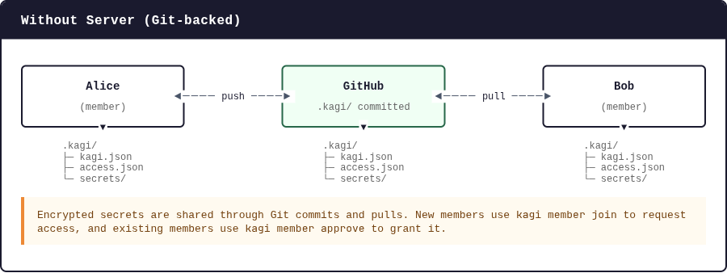
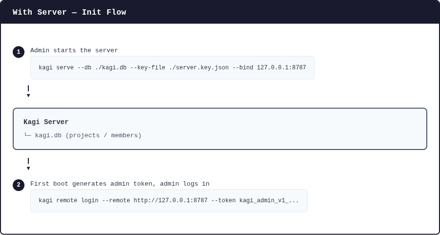
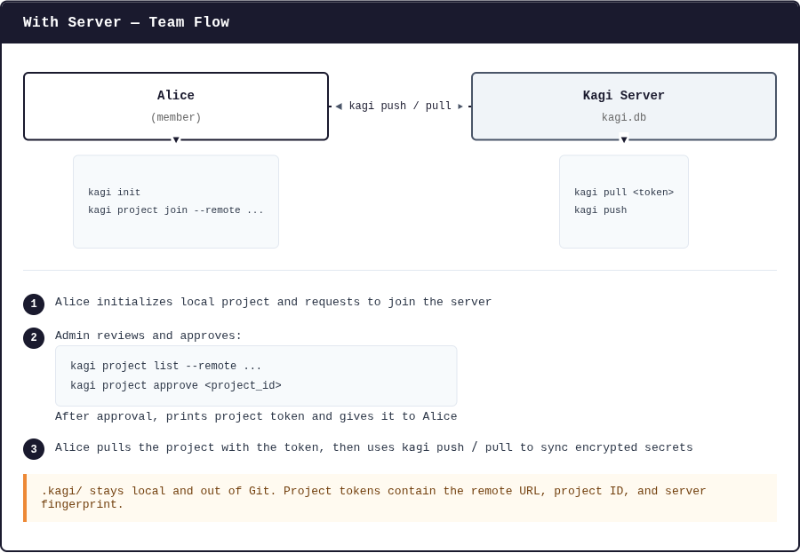

# kagi

[](https://skills.sh/BANG88/kagi)


一个安全、支持团队协作的 CLI 工具，用于管理加密的环境变量和密钥 —— 替代 `.env` 文件，支持按服务隔离和团队共享。

**kagi** (鍵，日语中"钥匙"的意思) 使用 XChaCha20-Poly1305 对密钥进行静态加密，同时让开发和部署时的密钥注入变得简单。

---

## 功能特性

- 使用 XChaCha20-Poly1305 静态加密密钥
- 开箱即用的团队协作：一个人就是团队中的唯一成员
- 支持按服务和环境隔离，例如 `api/development` 和 `web/production`
- `development` 是默认环境，日常命令更简洁
- 嵌套服务推断：在 `./api` 或 `./apps/api` 这类 monorepo 目录内运行 `kagi run bun dev` 即可工作
- `.kagi/` 目录设计为可提交到 Git；私钥保存在每个设备上
- `get --show` 和 `export` 在显示密钥值前需要终端确认
- `kagi init` 会保守检测高置信度 `.env*` 文件，并可为 monorepo 服务目录建立映射
- 通过 `kagi file` 管理小型加密文件，作用域与 env 密钥一致

---

## 安装

### 从 crates.io 安装

```bash
# 默认：包含远程同步服务器
cargo install kagi-vault

# 仅 CLI：排除服务器代码和服务器相关命令
cargo install kagi-vault --no-default-features
```

需要 Rust 1.85+ (2024 edition)。

### 从本地源码安装

```bash
git clone https://github.com/BANG88/kagi.git
cd kagi

# 默认：包含远程同步服务器
cargo install --path .

# 仅 CLI：排除服务器代码和服务器相关命令
cargo install --path . --no-default-features
```

---

## 使用方式总览

### 无服务器模式（Git 共享）



加密密钥通过 Git 提交共享。新成员使用 `kagi member join` 申请，现有成员用 `kagi member approve` 审批。

### 服务器模式（远程同步）

**1. 初始化服务器**



**2. 团队协作**



- `.kagi/` 保留在本地，不提交到 Git。
- 项目令牌包含远程 URL、项目 ID 和服务器指纹。

**如何选择：**
- **无服务器模式**：想将 `.kagi/` 提交到 Git 时使用（默认推荐）
- **服务器模式**：不想将 `.kagi/` 提交到 Git 时使用

---

## 日常使用

### 1. 初始化

```bash
kagi init --nested --envs
```

`--envs` 不带参数会创建标准环境：`development`、`test` 和 `production`。

`development` 是默认环境，所以通常不需要指定。`--nested` 让 kagi 可以根据当前目录推断服务名称。在 monorepo 中，`init` 会记录 `apps/api`、`packages/api` 这类检测到的服务路径，所以在这些目录里运行命令不需要手动指定 `--service`。

提交生成的 `.kagi/` 文件：

```bash
git add .kagi .gitignore
git commit -m "chore: initialize kagi"
```

私钥不会写入 `.kagi/` 目录。

### 2. 设置密钥

从仓库根目录：

```bash
kagi set api DATABASE_URL postgres://localhost/api
kagi set api production DATABASE_URL postgres://db/prod
```

通过 `set` 和 `get` 手动传入的 key 默认会转换为 upper snake case，例如 `abc-d` 会变成 `ABC_D`。发生转换时 kagi 会打印一条简短提示。

在 `./api` 目录内：

```bash
kagi set DATABASE_URL postgres://localhost/api
kagi set production DATABASE_URL postgres://db/prod
```

两种短命令都会写入相同的范围：

| 命令 | 范围 |
|---------|-------|
| `kagi set api DATABASE_URL ...` | `api/development` |
| `kagi set DATABASE_URL ...` 在 `./api` 内 | `api/development` |
| `kagi set api production DATABASE_URL ...` | `api/production` |
| `kagi set production DATABASE_URL ...` 在 `./api` 内 | `api/production` |

### 3. 查看已设置的密钥

```bash
kagi get
kagi get api
kagi get api production
```

`get` 列出服务、环境和密钥名称（值已脱敏）。仅在需要时显示真实值：

```bash
kagi get api --show
kagi get api DATABASE_URL
```

两个命令都需要交互式确认 `y`。

### 4. 运行应用

从仓库根目录：

```bash
kagi run api bun dev
kagi run api production bun start
```

在 `./api` 目录内：

```bash
kagi run bun dev
kagi run production bun start
```

`kagi run` 将选定的环境变量注入到子进程中。对于管道、重定向或 `$VAR` 扩展等 shell 语法，显式运行 shell：

```bash
kagi run api sh -c 'echo "$DATABASE_URL" | wc -c'
```

### 5. 提交加密后的变更

```bash
git add .kagi
git commit -m "chore: update kagi secrets"
```

不要提交真实的 `.env` 文件。`kagi init` 会更新 `.gitignore`，确保 `.env`、`.env.*` 和本地私钥材料不会被提交到 Git。

---

## 常用命令

| 任务 | 命令 |
|------|---------|
| 使用标准环境初始化 | `kagi init --nested --envs` |
| 设置开发环境密钥 | `kagi set api KEY value` |
| 设置生产环境密钥 | `kagi set api production KEY value` |
| 列出脱敏密钥 | `kagi get` |
| 显示密钥值 | `kagi get api --show` |
| 显示当前项目上下文 | `kagi status` |
| 使用开发环境运行应用 | `kagi run api bun dev` |
| 在服务目录内运行应用 | `kagi run bun dev` |
| 添加环境 | `kagi env add staging` |
| 重命名环境 | `kagi env rename staging preview` |
| 删除环境 | `kagi env del preview` |
| 导入 env 文件 | `kagi import api --file .env.local` |
| 预览导入结果 | `kagi import api --file .env.local --dry-run` |
| 导入并转换 key | `kagi import api --file .env.local --upper-snake` |
| 添加加密文件 | `kagi file add api service-account.json` |
| 列出加密文件 | `kagi file list api` |
| 恢复加密文件 | `kagi file restore api service-account.json` |
| 导出所有服务环境 | `kagi export api --out .` |
| 从示例同步缺失密钥 | `kagi sync --service api` |

当快捷方式可能有歧义时使用 `--service <name>`：

```bash
kagi set --service api production DATABASE_URL postgres://db/prod
kagi run --service api production bun start
```

环境名称不能与现有服务名称冲突。

---

## 与 `.env` 文件配合使用

`kagi init` 会检测最深四层目录内的高置信度 `.env*` 文件，并在初始化时询问是否导入。它会刻意保守：`.env` 和 `.env.example` 映射到默认环境；`.env.dev` 这类文件只有在 `dev` 是已配置环境时才会自动导入。使用 `--no-migrate` 可以跳过导入提示。

启用 `--nested` 时，检测到的嵌套 env 文件也会创建 monorepo 服务映射。例如 `apps/api/.env.dev` 会把 `apps/api` 内运行的命令映射到 `apps-api` 服务，`packages/api/.env.dev` 会映射到 `packages-api`。

导入现有的本地文件：

```bash
kagi import api --file .env.development
kagi import api production --file .env.production
kagi import api --file .env.local --dry-run
```

手动导入默认保留原始 key 名称。如果希望导入时也转换成 upper snake case，可以加 `--upper-snake`。

导出正常的环境文件：

```bash
kagi export api --out .
```

这会为每个环境写入一个文件：

```text
.env.development
.env.test
.env.production
```

导出解密值需要终端确认。日常脚本优先使用 `kagi run`。

当 `.env.example` 新增密钥时，`sync` 很有用：

```bash
kagi sync --service api
```

现有值永远不会被覆盖。

---

## 与加密文件配合使用

`kagi file` 用于小型私密文件，并且复用 env 密钥的服务和环境作用域：

```bash
kagi file add api service-account.json
kagi file list api
kagi file restore api service-account.json
```

在嵌套目录或 monorepo 服务目录内，推断规则与 `set`、`get`、`run`、`import`
一致：

```bash
cd apps/api
kagi file add dev service-account.json
kagi file list dev
kagi file restore dev service-account.json
```

文件会以加密 blob 存在 `.kagi/files/` 中。文件名、恢复路径和作用域都保存在加密的
`files/index.enc` 里；Git 和远程服务器只能看到 `files/kgf_xxxxxx.enc` 这类不透明加密文件。

`restore` 默认写回 `add` 时记录的仓库相对路径；也可以用 `--out <path>` 指定输出位置：

```bash
kagi file restore api service-account.json --out apps/api/service-account.json
```

安全限制：

- 默认单文件最大 1 MiB。
- `--allow-large` 将上限提高到 5 MiB。
- 拒绝目录、symlink、设备文件、构建产物目录、`.git/` 和 `.kagi/` 路径。
- 已被 Git 跟踪的明文文件会被拒绝；先用 `git rm --cached <path>` 从 Git 移除。
- `show` 会打印解密内容，因此需要终端确认。
- `restore` 默认不覆盖已有明文文件，除非使用 `--force`。

Git 共享和自托管 server 同步使用同一份加密 project state。提交或同步
`.kagi/files/**`，不要提交恢复出来的明文文件。

---

## 团队流程

项目始终支持团队协作。如果你独自工作，你就是唯一的成员。

新设备或新成员：

```bash
kagi member join --name alice
git add .kagi/access.json
git commit -m "chore: request kagi access"
```

现有成员审批：

```bash
kagi member list
kagi member approve <member_id>
git add .kagi/access.json
git commit -m "chore: approve kagi member"
```

如果多人同时请求访问，合并 PR 时保留 `.kagi/access.json` 中的所有待处理条目。

移除访问权限：

```bash
kagi member del <member_id>
git add .kagi
git commit -m "chore: remove kagi member"
```

`member del` 会在内部轮换项目密钥，并为活跃成员重新加密当前密钥。如果轮换中断，kagi 会在仓库外写入本地日志，并在下次命令时安全重试。

---

## 远程服务器同步

Git 共享的 `.kagi/` 是默认工作流。如果团队不想提交 `.kagi/`，可以运行自托管的 Kagi 服务器。

状态：**生产就绪的自托管团队使用** — 需要 HTTPS、适当的备份和监控。详见 `docs/remote-sync-server.md` 了解完整协议、部署指南和 Docker/systemd 示例。

Kagi 服务器明确为**单租户**。每个服务器实例服务一个团队或组织。不要为不相关的租户运行单个服务器实例。

### HTTP 限制

服务器默认拒绝非本地的 `http://` 远程地址。对于任何公开或局域网部署使用 HTTPS。仅本地开发时，传递 `--allow-insecure-http` 或设置 `KAGI_ALLOW_INSECURE_HTTP=1`：

```bash
kagi project join --remote http://127.0.0.1:8787
```

### 启动服务器

```bash
kagi serve --db ./kagi.db --key-file ./server.key.json --bind 127.0.0.1:8787
```

首次启动时，服务器会打印一个管理员令牌。安全保存后，从管理员机器登录：

```bash
kagi remote login --remote http://127.0.0.1:8787 --token kagi_admin_v1_...
```

创建本地项目并请求服务器注册：

```bash
kagi init --nested --envs
kagi project join --remote http://127.0.0.1:8787
```

管理员审批待处理请求：

```bash
kagi project list --remote http://127.0.0.1:8787
kagi project approve --remote http://127.0.0.1:8787 <project_id>
```

`approve` 会打印一个项目令牌。将该令牌一次性交给请求者。令牌包含远程 URL、项目 ID 和服务器指纹：

```bash
kagi pull <project-token>
kagi push
kagi status
```

在服务器模式下，将 `.kagi/` 保留在本地，不提交到 Git。项目令牌是 bearer 凭证，存储在 `.kagi/` 之外；管理员令牌存储在 OS 钥匙串中或通过 `KAGI_ADMIN_TOKEN` 提供。

---

## CI 和容器

对于 CI，将项目密钥存储在密钥管理器中，并将其挂载为文件：

```bash
KAGI_PROJECT_KEY_FILE=/run/secrets/kagi_project_key kagi run api bun test
```

当文件挂载不可用时，也支持 `KAGI_PROJECT_KEY=<64-hex-chars>`，但文件密钥更容易避免出现在日志中。

对于本地 Docker 开发，优先在主机上通过 kagi 运行进程：

```bash
kagi run api docker compose up
```

如果容器本身需要读取 env 文件，在需要时导出，并确保 `.env*` 被 Git 忽略。

---

## 安全模型

对于 Git 支持的项目，提交这些文件：

```text
.kagi/kagi.json
.kagi/access.json
.kagi/secrets/**/*.enc
.env.example
```

不要提交这些文件：

```text
真实的 .env / .env.* 文件
本地项目密钥
本地 age 身份 / 私钥
KAGI_PROJECT_KEY 值
包含密钥的日志或截图
```

仓库包含加密密钥存储、公共成员收件人和加密访问包装器。它不包含原始项目密钥或私钥身份。

对于服务器支持的项目，将 `.kagi/` 保留在本地，改用 `kagi push` / `kagi pull` 同步加密状态。

密钥使用 XChaCha20-Poly1305 加密，并用其范围名称认证，因此加密文件不能静默移动到另一个范围。

`kagi get <key>`、`kagi get --show` 和 `kagi export` 显示解密数据，需要确认。`kagi run` 对脚本更安全，但它不是沙箱：子进程会接收选定的密钥作为环境变量。

如果每个活跃成员都丢失了本地密钥材料，且没有 CI 密钥，则加密密钥按设计是不可恢复的。

---

## 架构

kagi 遵循 **Clean Architecture**，分为四层：

| 层 | 职责 |
|-------|----------------|
| **Domain** | 实体 (`Service`、`Secret`)、存储库特征、错误类型、解析器 |
| **Application** | 用例：`InitService`、`SetSecretService`、`GetSecretService`、`RunCommandService` 等 |
| **Infrastructure** | 具体实现：`FileStore`、`XChaChaEncryptor`、`KeyManager`、`SystemCommandRunner` |
| **CLI** | 参数解析 (`clap`)、命令分发、终端样式 |

这使得可以轻松地将基于文件的存储替换为远程后端，或在不接触业务逻辑的情况下替换加密实现。

---

## 开发

```bash
# 运行所有测试（带服务器功能）
cargo test

# 不带服务器功能运行测试
cargo test --no-default-features

# 仅运行集成测试
cargo test --test integration_tests

# 运行真实的 OS 钥匙串冒烟测试
cargo test test_os_keychain_project_key_survives_local_data_loss -- --ignored

# 尝试 Bun 示例
cd tests
kagi init --nested --envs
cd api
kagi set MESSAGE "from kagi"
bun dev

# 本地安装
cargo install --path .
```

默认测试套件使用隔离的本地存储，以便在 CI 中运行。被忽略的钥匙串冒烟测试需要真实的已解锁 OS 钥匙串/会话，并验证 kagi 在本地数据文件删除后仍能加载项目密钥。

---

## 许可证

MIT
